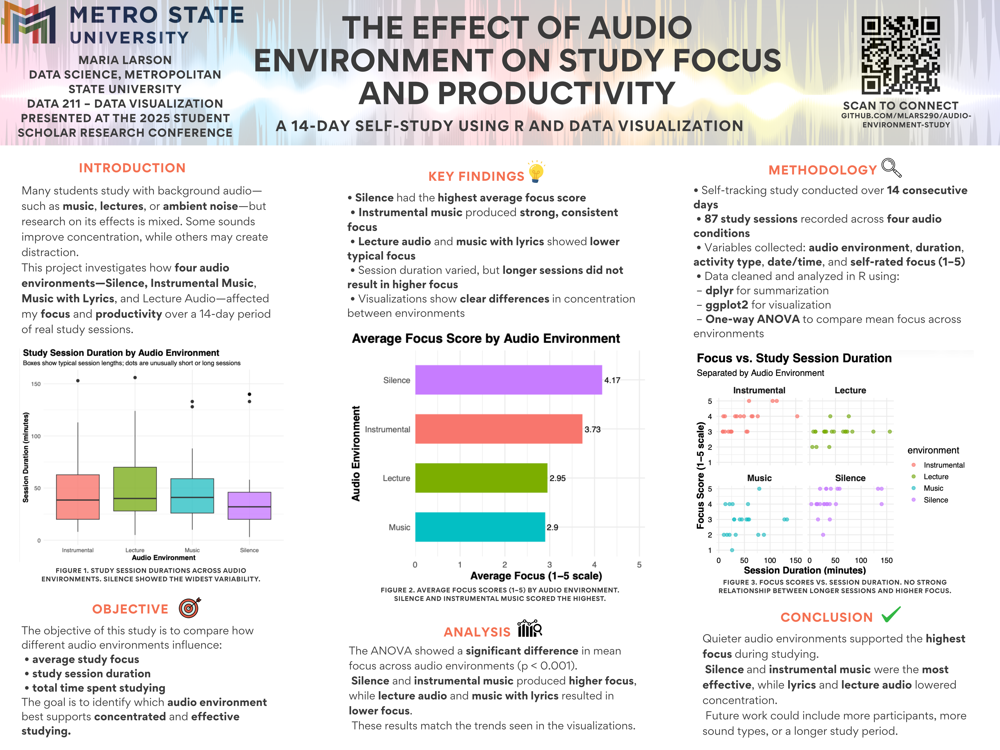
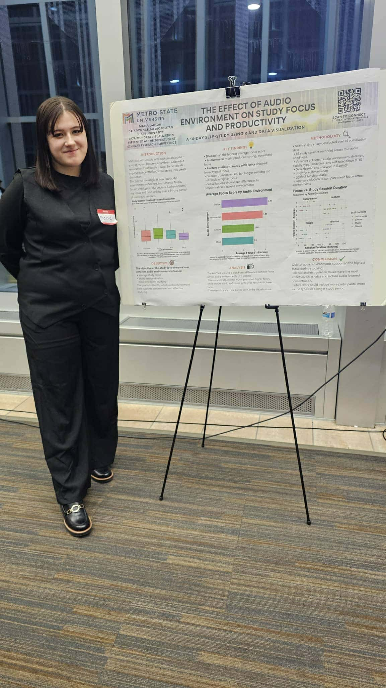

# 🎧 Audio Environment Study: Focus & Productivity  
### A 14-Day Quantitative Analysis of How Sound Influences Study Concentration

**Maria K. Larson**  
Data Science Undergraduate — Metropolitan State University  

  
  
  
  

---

## 📊 Research Impact & Recognition

- **Published in the MetroWorks Student Research Collection**  
  https://metroworks.metrostate.edu/student-scholarship/22/  
- Ranked among the **Top 10 most-downloaded papers** in the collection  
- Achieved **10+ full-text downloads within the first month**  
- **Presented at the 2025 Metro State Student Scholar Research Conference**  
- Selected by faculty as an **exemplary Data Visualization project**

---

## 🧾 Abstract

This quantitative self-tracking study investigates how four distinct audio environments influence study focus and productivity.  
Across **87 logged study sessions over 14 days**, behavioral data were analyzed using **R, tidyverse workflows, data visualization, and one-way ANOVA with Tukey post-hoc testing** to identify statistically significant differences in concentration across sound conditions.

---

## 🔍 Study Overview

### Audio Environments Examined
- **Silence** (no background audio)  
- **Instrumental Music** (lo-fi and ambient study tracks)  
- **Lecture Audio** (recorded instructional content)  
- **Music with Lyrics** (primarily K-pop and pop music)  

### Data Collected per Session
- Session timing and duration  
- Task activity  
- Audio environment  
- Observational notes  
- **Focus rating (1–5 scale)**  

Initial data reflected natural listening habits.  
Mid-study adjustments balanced representation of **silence** and **instrumental** conditions to support fair statistical comparison.

---

## 🎯 Key Findings

- **Silence** and **instrumental music** produced the **highest concentration levels**.  
- **Lecture audio** and **music with lyrics** were associated with **reduced focus**.  
- **Session duration showed no meaningful relationship** with focus.  
- **One-way ANOVA (p < 0.001)** confirmed significant differences across environments.  
- **Tukey post-hoc testing** identified which environments differed statistically.

---

## 🖼️ Research Poster

  

📄 **Full poster (PDF):**  
poster/AudioEnvironment_StudyPoster.pdf

---

## 🎤 Conference Presentation

  

Presented at the **2025 Metro State Student Scholar Research Conference**  
📎 https://libguides.metrostate.edu/student_research_conference/

---

## 📊 Visualizations

All exported figures and combined graphical outputs:  
**visualizations/visualizations_all_graphs.pdf**

Visualizations include:
- Focus by audio environment  
- Distribution boxplots  
- Session duration relationships  
- Summary comparison charts  

---

## 🛠 Tools & Methods

**Programming & Analysis**
- R  
- tidyverse (dplyr, readxl, etc.)  
- ggplot2  
- One-way ANOVA  
- TukeyHSD post-hoc testing  

**Data Collection**
- Excel-based structured logging  

**Documentation & Reproducibility**
- GitHub version control  
- Research poster & conference presentation  

---

## ⭐ Skills Demonstrated

- Experimental design with controlled variables  
- Behavioral data collection and structuring  
- Data cleaning and transformation in R  
- Statistical inference and hypothesis testing  
- Data visualization for scientific communication  
- Research presentation and scholarly publication  
- Technical documentation and portfolio organization  

---

## 🚀 Future Research Directions

Planned extensions of this work include:

- Longer-term data collection for increased statistical power  
- Additional behavioral variables (sleep, mood, interruptions, task difficulty)  
- **Mixed-effects modeling** for repeated-measures analysis  
- Automated logging via **Shiny app or mobile interface**  
- Inclusion of **effect sizes and confidence intervals**  
- Measuring **productivity outcomes**, not only perceived focus  
- Exploring **machine learning classification of study environments**

---

## 💡 Significance

This study demonstrates how **everyday behavioral choices**, such as background audio, measurably influence concentration.  
More broadly, it illustrates the practical impact of combining:

- Real-world behavioral data  
- Statistical analysis  
- Data visualization  
- Evidence-based interpretation  

The project serves as a **foundational example of applied data science in human productivity research**.

---

## 📚 Citation

Larson, M. K. (2025).  
*The Effect of Audio Environments on Study Focus.*  
Metro State Student Scholar Research Conference.  
MetroWorks Student Research Collection.  
https://metroworks.metrostate.edu/student-scholarship/22/

---

## 🔐 Code Availability

To comply with academic integrity guidelines, the **full R analysis code and raw dataset are not publicly distributed**.  
Access may be provided **upon academic or professional request**.

---

## 🤝 Connect With Me

I am currently seeking opportunities in:

- **Data Science**
- **Analytics**
- **Research & Statistical Modeling**

🔗 LinkedIn: https://www.linkedin.com/in/mlars29/  
💻 GitHub: https://github.com/Mlars290  

---

<strong>Thank you for viewing my research.</strong>

