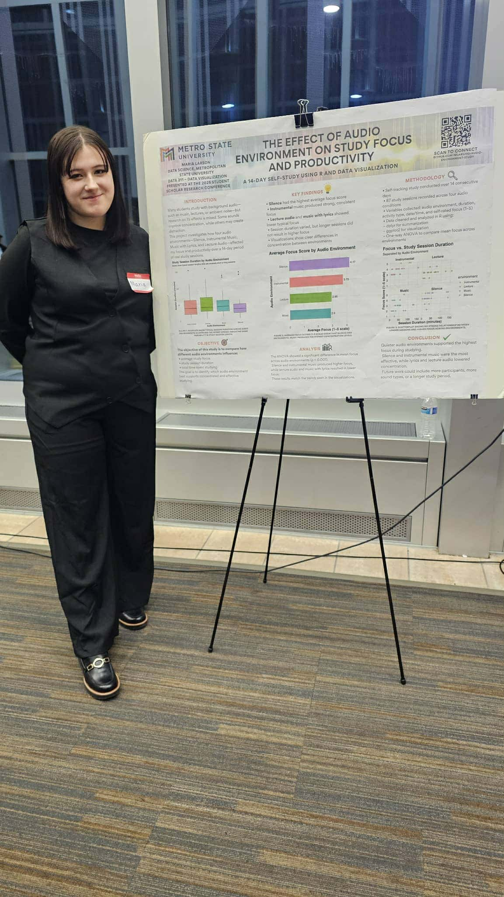
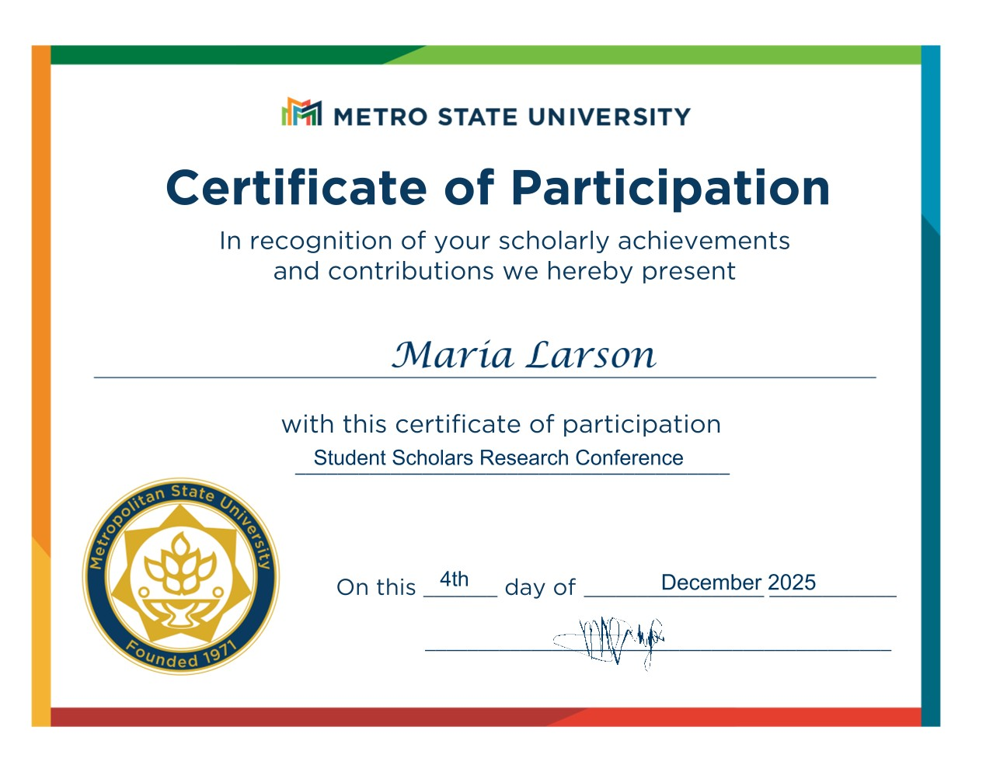

# 🎧 Audio Environment Study: Focus & Productivity

> **Published undergraduate research investigating how different audio environments influence study focus using statistical analysis in R.**

**Maria K. Larson**  
*B.S. Data Science | Metropolitan State University*

---

# 🏆 Project Highlights

- 📚 Published in the **MetroWorks Student Research Collection**
- 🎤 Presented at the **2025 Metropolitan State University Student Research Conference**
- 📥 **68+ full-text downloads** on MetroWorks
- 📊 Original behavioral research using R and statistical analysis
- 📈 Applied **One-Way ANOVA**, **Tukey HSD**, and **ggplot2**

🔗 **Publication**

https://metroworks.metrostate.edu/student-scholarship/22/

---

# 🎤 Research Presentation

  

Presented **The Effect of Audio Environments on Study Focus and Productivity** at the **2025 Metropolitan State University Student Research Conference**.

---

# 🏅 Conference Recognition

  

Certificate awarded for presenting original undergraduate research at the **2025 Metropolitan State University Student Research Conference**.

---

# 🖼 Research Poster

  

📄 **Full Poster (PDF)**

[Audio Environment Study Poster](poster/audio-environment-study-poster.pdf)

---

# 📊 Statistical Visualizations

This study generated multiple visualizations summarizing focus scores and statistical findings across different listening environments.

The visualization package includes:

- 📈 Average focus ratings by audio environment
- 📦 Distribution boxplots
- ⏱ Session duration relationships
- 📊 Summary comparison charts
- 📉 ANOVA visualization outputs

📄 **View All Visualizations**

[Audio Study Visualizations](visualizations/audio-study-visualizations.pdf)

---

# 📖 Project Overview

This project investigates how four different audio environments influence study focus and productivity.

Across **87 logged study sessions over 14 days**, behavioral data were collected, cleaned, analyzed, and visualized using R to determine whether different listening environments produced statistically significant differences in concentration.

---

# 🔬 Research Design

## Audio Environments

- 🎧 Silence
- 🎵 Instrumental Music
- 🎙 Lecture Audio
- 🎤 Music with Lyrics

## Data Collected

- Session duration
- Audio environment
- Study activity
- Focus score (1–5)
- Observational notes

---

# 🧪 Statistical Methods

- Data Cleaning
- Feature Engineering
- One-Way ANOVA
- Tukey HSD Post-Hoc Testing
- Data Visualization with ggplot2

---

# 🎯 Key Findings

- Silence and instrumental music produced the highest average focus.
- Lecture audio and music with lyrics resulted in lower concentration.
- Session duration showed little relationship with focus.
- One-Way ANOVA identified statistically significant differences between audio environments (**p < 0.001**).
- Tukey HSD determined which environments differed significantly.

---

# 🛠 Technologies Used

- R
- tidyverse
- ggplot2
- Excel
- One-Way ANOVA
- Tukey HSD

---

# ⭐ Skills Demonstrated

- Experimental Design
- Behavioral Data Collection
- Statistical Analysis
- Hypothesis Testing
- One-Way ANOVA
- Tukey HSD
- Data Cleaning
- Data Visualization
- Research Communication
- Technical Writing

---

# 💡 Impact

This project demonstrates how applied statistics and data visualization can be used to investigate real-world behavioral questions.

Beyond the research findings, it showcases the complete analytics workflow:

- Designing a research study
- Collecting structured data
- Cleaning and preparing data
- Performing statistical analysis
- Visualizing results
- Presenting findings to an academic audience
- Publishing research in a university repository

---

# 📚 Citation

Larson, M. K. (2025).

**The Effect of Audio Environments on Study Focus and Productivity.**

Metropolitan State University Student Research Conference.

MetroWorks Student Research Collection.

https://metroworks.metrostate.edu/student-scholarship/22/

---

# 🔐 Code Availability

To comply with academic integrity guidelines, the complete R analysis code and raw dataset are not publicly distributed.

The research poster, publication, presentation materials, statistical methodology, and visualizations remain publicly available.

---

# 🤝 Connect

**LinkedIn**

https://www.linkedin.com/in/mlars29/

**GitHub**

https://github.com/Mlars290

---

Thank you for taking the time to explore this research project.
